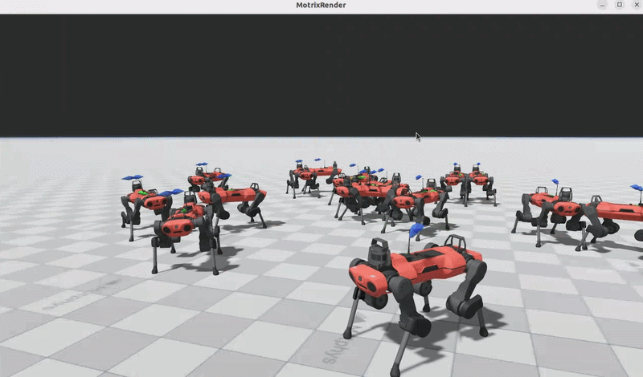

# Anymal C Navigation — MotrixLab 导航环境

基于 [MotrixLab](https://github.com/motphys/MotrixLab) 框架实现的 Anymal C 四足机器人导航任务，
奖励函数设计参考 [Isaac Lab](https://github.com/isaac-sim/IsaacLab) 的 `NavigationEnvCfg`，
机器人模型来源于 [mujoco\_menagerie](https://github.com/google-deepmind/mujoco_menagerie)。

\---

## 项目结构

```
anymal\_c\_project/
├── README.md                  # 项目说明
├── pyproject.toml             # 项目打包配置
├── train.py                   # 训练入口
├── play.py                    # 推理可视化入口
├── view.py                    # 随机动作可视化入口
├── cfgs.py                    # PPO 训练超参数配置
└── navigation/
    └── anymal\_c/
        ├── \_\_init\_\_.py        # 模块导出，注册环境到 MotrixLab registry
        ├── cfg.py             # 环境配置类
        ├── anymal\_c\_np.py     # 环境实现（继承 NpEnv）
        └── xmls/
            ├── scene.xml      # 主场景文件（地面、光照）
            ├── anymal\_c.xml   # 机器人 MJCF 模型
            └── assets/        # 网格、贴图资源
```

\---

## 环境说明

### 任务描述

Anymal C 四足机器人在平坦地面上执行导航任务：给定随机目标位置（±3m）和目标朝向（±π），
机器人需要走到目标点并保持正确朝向后停止。

### 观测空间（54维）

|项目|维度|说明|
|-|-|-|
|基座线速度 lin\_vel|3|机体系 x/y/z，归一化 ×2.0|
|基座角速度 gyro|3|机体系 x/y/z，归一化 ×0.25|
|重力投影 projected\_gravity|3|重力向量在机体系投影，反映姿态|
|关节位置 joint\_pos|12|12关节相对默认角度偏差，×1.0|
|关节速度 joint\_vel|12|12关节角速度，×0.05|
|上一步动作 last\_actions|12|上一控制步网络输出|
|速度指令 commands|3|期望线速度(vx,vy)和角速度(wz)|
|位置误差 position\_error|2|目标与当前位置差，除以5归一化|
|朝向误差 heading\_error|1|目标与当前朝向差，除以π归一化|
|目标距离 distance|1|到目标距离，clip到\[0,1]|
|是否到达 reached\_flag|1|位置误差<0.3m且朝向误差<15°时为1|
|是否停稳 stop\_ready\_flag|1|到达且角速度<0.05rad/s时为1|
|**合计**|**54**||

### 动作空间（12维）

|关节|维度|说明|
|-|-|-|
|LF\_HAA / LF\_HFE / LF\_KFE|3|左前腿：髋外展 / 髋屈伸 / 膝屈伸|
|RF\_HAA / RF\_HFE / RF\_KFE|3|右前腿：髋外展 / 髋屈伸 / 膝屈伸|
|LH\_HAA / LH\_HFE / LH\_KFE|3|左后腿：髋外展 / 髋屈伸 / 膝屈伸|
|RH\_HAA / RH\_HFE / RH\_KFE|3|右后腿：髋外展 / 髋屈伸 / 膝屈伸|
|**合计**|**12**|目标关节位置偏移量(rad)，缩放系数0.06|

### 奖励函数

参考 Isaac Lab `NavigationEnvCfg` 设计，使用双尺度 tanh 位置跟踪：

|奖励项|公式|权重|说明|
|-|-|-|-|
|位置跟踪（粗）|`1 - tanh(d / 2.0)`|0.5|远距离引导|
|位置跟踪（精）|`1 - tanh(d / 0.2)`|0.5|近距离精确到达|
|朝向跟踪|`-|heading\_error|`|
|终止惩罚|`-400.0`|1.0|倒地或侧翻惩罚|
|停止奖励|高斯函数|2.0|到达后鼓励速度归零|
|停稳额外奖励|角速度<0.05时|+6.0|完全停止额外奖励|

### 终止条件

1. 关节速度超过 100 rad/s 或出现 NaN/Inf（数值发散保护）
2. 机身与地面碰撞（倒地）
3. 机身倾斜角度超过 75°（侧翻）
4. Episode 超时（8秒）

\---

## 安装

### 前置要求

* Linux（Ubuntu 22.04 推荐）
* Python 3.10
* MotrixLab（已安装在 `\~/Desktop/MotrixLab`）
* conda 环境 `MotrixSim`

### 安装步骤

**第一步：激活 conda 环境**

```bash
conda activate MotrixSim
```

**第二步：安装 MotrixLab 依赖**

```bash
cd \~/Desktop/MotrixLab/motrix\_envs \&\& python3 -m pip install -e .
cd \~/Desktop/MotrixLab/motrix\_rl \&\& python3 -m pip install -e .
```

**第三步：安装本项目**

```bash
cd \~/Desktop/anymal\_c\_project \&\& python3 -m pip install -e .
```

**第四步：安装额外依赖**

```bash
python3 -m pip install gymnasium
```

**第五步：验证安装**

```bash
cd \~/Desktop/anymal\_c\_project \&\& python3 -c "
from navigation.anymal\_c.cfg import AnymalCNavCfg
from navigation.anymal\_c.anymal\_c\_np import AnymalCNavEnv
import numpy as np
env = AnymalCNavEnv(AnymalCNavCfg(), num\_envs=1)
state = env.init\_state()
state = env.step(np.random.uniform(-1, 1, (1, 12)).astype(np.float32))
print('✅ 安装成功！观测维度:', state.obs.shape)
"
```

输出 `✅ 安装成功！观测维度: (1, 54)` 表示安装正常。

\---

## 使用方法

### 1\. 随机动作可视化

用随机动作驱动机器人，验证环境是否正常：

```bash
cd \~/Desktop/anymal\_c\_project \&\& uv --directory \~/Desktop/MotrixLab run python3 view.py --num-envs 1
```

多环境并行：

```bash
cd \~/Desktop/anymal\_c\_project \&\& uv --directory \~/Desktop/MotrixLab run python3 view.py --num-envs 16
```

### 2\. 训练

使用 PPO 算法训练导航策略：

```bash
cd \~/Desktop/anymal\_c\_project \&\& uv --directory \~/Desktop/MotrixLab run python3 train.py \\
  --env anymal\_c\_nav \\
  --num-envs 2048 \\
  --train-backend torch
```

训练日志自动保存在 `runs/anymal\_c\_nav/时间戳\_PPO/`，包含：

* `checkpoints/best\_agent.pt`：最优策略权重
* `checkpoints/agent\_XXXXX.pt`：各时间步的权重
* TensorBoard 日志

查看训练曲线：

```bash
uv --directory \~/Desktop/MotrixLab run tensorboard --logdir \~/Desktop/anymal\_c\_project/runs/
```

然后浏览器打开 `http://localhost:6006`。

### 3\. 推理测试

加载训练好的最优 checkpoint 进行推理：

```bash
# 单环境（推荐用于录制视频）
cd \~/Desktop/anymal\_c\_project \&\& uv --directory \~/Desktop/MotrixLab run python3 play.py --num-envs 1

# 多环境
cd \~/Desktop/anymal\_c\_project \&\& uv --directory \~/Desktop/MotrixLab run python3 play.py --num-envs 12
```

`play.py` 会自动找到最新训练的最优 checkpoint 加载。

\---

## 训练结果

### PPO 超参数

|参数|值|说明|
|-|-|-|
|并行环境数|2048|训练时|
|最大训练步数|100M||
|学习率|3e-4|KL 自适应调整|
|rollouts|48|每次更新收集的步数|
|learning\_epochs|6|每次更新训练轮数|
|mini\_batches|32||
|discount\_factor|0.99|折扣因子|
|lambda|0.95|GAE 参数|
|网络结构|(256, 128, 64)|策略网络和价值网络|

### 训练曲线关键指标

|指标|初始值|收敛值|说明|
|-|-|-|-|
|Total reward (mean)|\~-100|\~3238|策略显著改善|
|Total reward (max)|\~250|\~4219|最优环境表现|
|Episode length (mean)|\~340步|\~397步|机器人能坚持更久|
|Learning rate|3e-4|\~1e-4|KL 自适应下降|

### 可视化说明

运行 `play.py` 或 `view.py` 后，渲染窗口中：

* **红色圆柱**：目标位置标记，机器人需要走到这里
* **绿色箭头**：机器人当前实际速度方向
* **蓝色箭头**：期望速度方向（朝向目标点）

\---

## 常见问题

### Q: 运行时报 `ModuleNotFoundError: No module named 'navigation'`

**A:** 确认在 `anymal\_c\_project` 目录下运行，或者重新安装：

```bash
cd \~/Desktop/anymal\_c\_project \&\& python3 -m pip install -e .
```

### Q: 报 `Environment 'anymal\_c\_nav' is not registered`

**A:** 需要先 import 我们的模块触发注册，确认 `train.py`、`play.py`、`view.py` 顶部有：

```python
import navigation.anymal\_c
import cfgs
```

### Q: 16个环境渲染窗口空白

**A:** 检查 `scene.xml` 里没有额外的 `camera` 定义，摄像机会干扰多环境渲染。

### Q: 训练日志没有保存在项目目录

**A:** 确认 `train.py` 顶部有：

```python
os.chdir(os.path.dirname(os.path.abspath(\_\_file\_\_)))
```


\### Demo


<p align="center">

&#x20; 

</p>


## 参考资料

* [MotrixLab 文档](https://github.com/motphys/MotrixLab)
* [Isaac Lab Navigation 环境](https://github.com/isaac-sim/IsaacLab/tree/main/source/isaaclab_tasks/isaaclab_tasks/manager_based/navigation)
* [mujoco\_menagerie Anymal C](https://github.com/google-deepmind/mujoco_menagerie/tree/main/anybotics_anymal_c)
* [skrl 文档](https://skrl.readthedocs.io)
* [MuJoCo 文档](https://mujoco.readthedocs.io)

